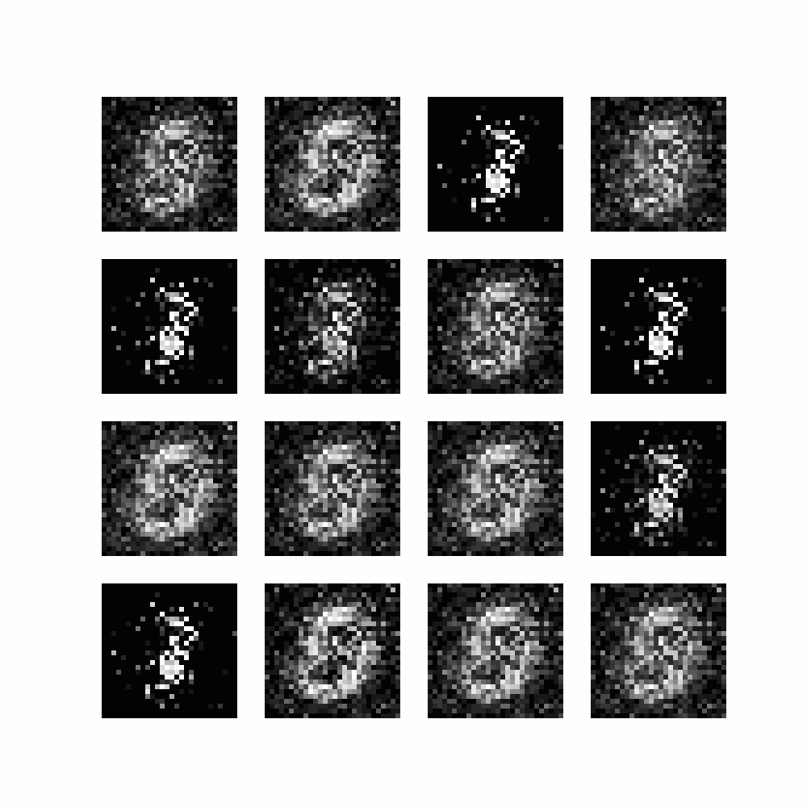

# Papers of the Week


## PoW Series

The IE Robotics Club organizes the AI Paper of the Week, a **discussion on a trending topic related to Robotics or AI**. During the event, we will be reviewing and analyzing a paper on one of these topics and **discussing the most intriguing aspects** of it in depth. Any doubts that may arise during the reading will be addressed.

📅 The paper to be discussed will be **chosen one week in advance** by all attendees of the upcoming event and will be published for **individual reading beforehand**.

🙋🏻‍♂️ You do **not need to be an expert** in the field or have an in-depth understanding of every concept presented in the paper. If you have a **passion for AI or a general interest in robotics** and wish to learn more, you are welcome to join the discussion as an active participant or simply listen in without any obligation.

✅ To ensure that everyone has access to the information presented during the event, we will **create slides and share them** via Notion. If you are unable to attend, you may access the slides from the **previous session and this week's paper** by accessing here: [Papers](https://www.notion.so/AI-PoW-Series-77071497fa224d2a897e77ec0f4b172a)

## Past Papers


 
| Topic | Paper | Code | Visuals |
| :---: | :---: | :---: | :---: |
| GANS  | Generative Adversial Networks | [Code](./gans/) |  |


## How to make this code run

#### 1. Create a virtual environment and activate it

```bash
make install TOPIC=gans
```


#### 2. Activate the virtual environment

```bash
cd <topic>
source .venv/bin/activate
```


## How to Contribute

Do you have code related to one of the papers, and it works? Then you can contribute to this repository. 

> Note!!! If you have code that works, make sure you commit a notebook showing the outputs of the code.


#### 1. Fork this repository

#### 2. Clone the repository

```bash
git clone
```

#### 3. Create a new branch

```bash
git checkout -b <your_branch_name>
```

#### 4. Make changes and commit

```bash
git add .
git commit -m "<your_commit_message>"
```

#### 5. Push changes to GitHub

```bash
git push origin <your_branch_name>
```

#### 6. Submit your changes for review

If you go to your repository on GitHub, you'll see a Compare & pull request button. Click on that button. Now submit the pull request.


