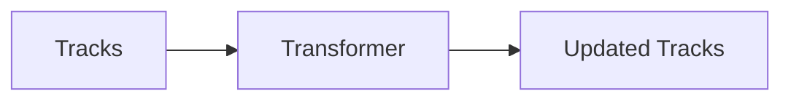
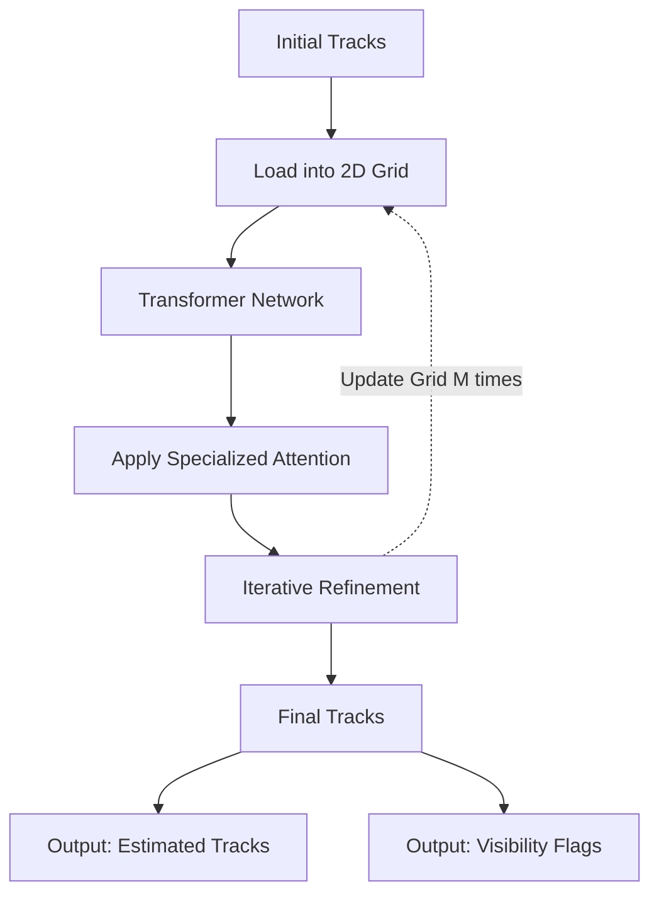

# CoTracker

A new state of the art architecture for optical flow and particle tracking proposed by meta. The key innovation in this project is the use of Transformer Architecture and the idea that tracking multiple particles concurrently, can help boos overall accuracy.

https://github.com/velocitatem/PoW/assets/60182044/527a3377-4f59-435f-a0e1-b8b65a838b08

## The Problem with Existing Methods

Traditionally, there are two main ways to predict motion in videos:

1. **Optical Flow**: This method estimates the motion of every single point in a video frame but only for a very short period.
2. **Point Tracking**: This focuses on tracking specific points over an extended period but does it independently, without considering the relationship between points.

Both methods have their limitations. For example, they struggle with tracking points that get temporarily hidden (occluded) or are part of the same object.

## High Level Overview
We first need to understand the inputs that go into the model. We have a video and a set of tracks for each particle. The tracks are initialized as null. The model then takes these tracks and updates them to better fit the ground truth. Lets look at the variables to better understand the problem:

This is done in a loop $M$ times:

### Legend for CoTracker Architecture Diagram (chart above)

- **Initial Tracks**: $(P_{ti}, t_i)^{N}_{i=1}$
  The starting locations and times of $N$ tracks.

- **Load into 2D Grid**: $G_{it}$
  The grid of input tokens, one for each track $i = 1, ..., N$, and time $t = 1, ..., T$.

- **Transformer Network**: $\Psi: G \rightarrow O$
  The transformer network that processes the 2D grid $G$ to improve a given estimate of the tracks.

- **Apply Specialized Attention**: Self-Attention in $\Psi$
  The specialized attention layers within the transformer that focus on important aspects of the motion.

- **Iterative Refinement**: $O_{ti}$
  The updated tracks are expressed by a corresponding grid of output tokens $O_{ti}$.

- **Final Tracks**: 
  The final estimated positions of the points being tracked.

- **Output: Estimated Tracks**: $\hat{P}_{t}$
  The final estimated positions of the points being tracked.

- **Output: Visibility Flags**: $\hat{v}_{ti}$
  The estimated visibility flags indicate whether each point is visible or occluded in each frame.
