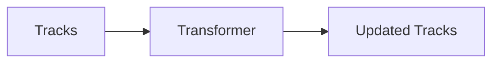
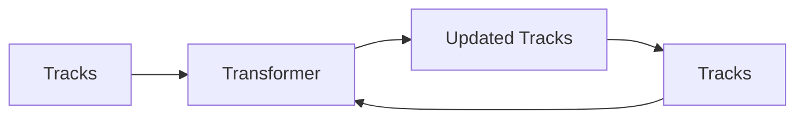

# CoTracker

A new state of the art architecture for optical flow and particle tracking proposed by meta. The key innovation in this project is the use of Transformer Architecture [^1] and the idea that tracking multiple particles concurrently, can help boos overall accuracy.

https://github.com/velocitatem/PoW/assets/60182044/527a3377-4f59-435f-a0e1-b8b65a838b08

## High Level Overview
We first need to understand the inputs that go into the model. We have a video and a set of tracks for each particle. The tracks are initialized as null. The model then takes these tracks and updates them to better fit the ground truth. Lets look at the variables to better understand the problem:

| Variable | Description |
| --- | --- |

This is done in a loop $M$ times:

