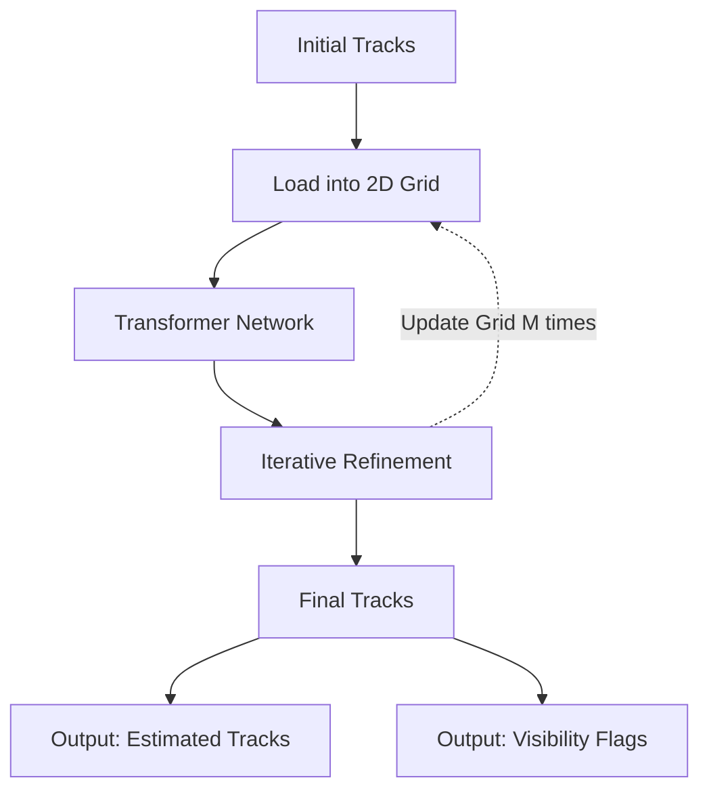

# CoTracker

A new state of the art architecture for optical flow and particle tracking proposed by meta. The key innovation in this project is the use of Transformer Architecture and the idea that tracking multiple particles concurrently, can help boos overall accuracy.

https://github.com/velocitatem/PoW/assets/60182044/527a3377-4f59-435f-a0e1-b8b65a838b08

## The Problem with Existing Methods

Traditionally, there are two main ways to predict motion in videos:

1. **Optical Flow**: This method estimates the motion of every single point in a video frame but only for a very short period.
2. **Point Tracking**: This focuses on tracking specific points over an extended period but does it independently, without considering the relationship between points.

Both methods have their limitations. For example, they struggle with tracking points that get temporarily hidden (occluded) or are part of the same object.

## High Level Overview

CoTracker is built on the idea that points in a video are often correlated. For example, if you're tracking the wheels of a car, it's likely that if one wheel moves, the other will too. The authors argue that by ignoring these correlations, we're missing out on improving the accuracy of tracking. So, they propose a new architecture that tracks multiple points jointly throughout an entire video sequence. This is a game-changer because it allows the model be more informed of the correlations between points that are being tracked.

### Legend for CoTracker Architecture Diagram (chart above)

- **Initial Tracks**: $(P_{ti}, t_i)^{N}_{i=1}$
  The starting locations and times of $N$ tracks. A track is essentially the temporal progression of the point throughout the entire video.

- **Load into 2D Grid**: $G_{it}$
  The grid of input tokens, one for each track $i = 1, ..., N$, and time $t = 1, ..., T$. You can think of a token as a small packet of information that describes a point you're tracking in a video. This packet contains various details like where the point is located on the screen, whether it's visible or hidden, what it looks like, and how it relates to its initial position.

- **Transformer Network**: $\Psi: G \rightarrow O$
  The transformer network that processes the 2D grid $G$ to improve a given estimate of the tracks.

- **Iterative Refinement**: $O_{ti}$
  The updated tracks are expressed by a corresponding grid of output tokens $O_{ti}$.

- **Final Tracks**:
  The final estimated positions of the points being tracked. Give me a multi-dimensional tensor, which for each frame contains the $x,y$ position of each POI.

- **Output: Estimated Tracks**: $\hat{P}_{t}$
  The final estimated positions of the points being tracked.

- **Output: Visibility Flags**: $\hat{v}_{ti}$
  The estimated visibility flags indicate whether each point is visible or occluded in each frame.

The technical backbone of CoTracker is a (transformer network)[https://mchromiak.github.io/articles/2017/Sep/12/Transformer-Attention-is-all-you-need/], a type of neural network that's particularly good at handling sequences and relationships within them. The transformer iteratively refines its estimates of where points are in each frame, effectively learning from the video as it goes along. What's even cooler is that this isn't just for short clips; CoTracker is designed to handle long videos by using a sliding-window approach. This means it can update its tracking in real-time as it processes the video, making it incredibly flexible and scalable.

## Combination with Viper

CoTracker could serve as one of the modules in ViperGPT's API. For example, a query like "Track the movement of the red car and the blue car and tell me when they are closest" could be answered by combining CoTracker's tracking capabilities with ViperGPT's code generation and reasoning.

> track the movement of the dog and the ball in the video and tell me if the dog catches the ball.

> Track the movement of all individuals in the surveillance video and alert if someone enters a restricted area.
